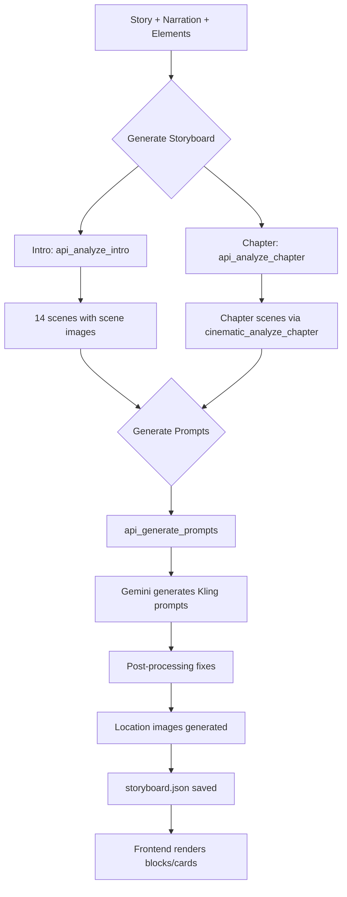
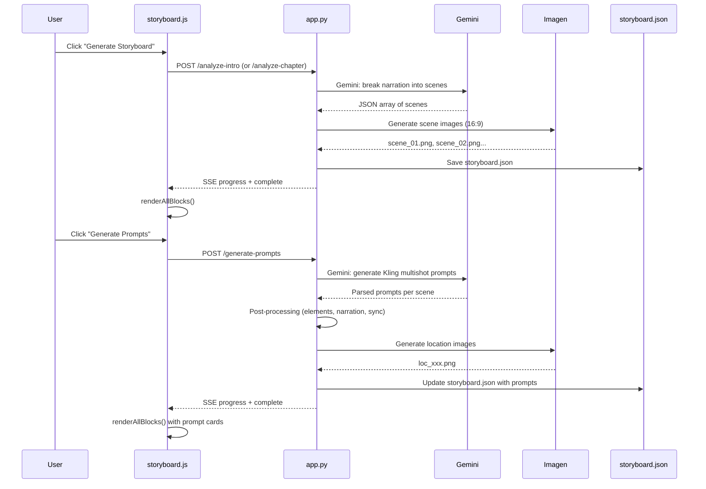

# Storyboard System — Technical Documentation

> Complete reference for the storyboard UI, scene generation, and video prompt pipeline.
> Last updated: 2026-02-23

---

## 1. Architecture Overview



**Key files:**

| File | Role |
|------|------|
| `app.py` | Backend API: scene generation, prompt generation, image generation |
| `static/storyboard.js` | Frontend: block/card rendering, avatar detection, modals |
| `static/storyboard.css` | UI styling for blocks, cards, avatars, modals |
| `templates/storyboard.html` | HTML template with modals and layout |
| `story_engine.py` | Gemini API wrapper, cinematic analysis, image generation |
| `production/{block}/storyboard.json` | Persisted scene + prompt data per block |

---

## 2. Block Structure

The storyboard is divided into **blocks** assembled in `buildBlocks()`:

```
INTRO → Chapter 1 → BREAK 1 → Chapter 2 → BREAK 2 → ... → CLOSE
```

| Block Type | Source | Generation Method |
|-----------|--------|-------------------|
| **INTRO** | `narration.intro.text` | `api_analyze_intro` → Gemini with 4 scene types |
| **Chapter N** | `narration.phases[N]` | `api_analyze_chapter` → `cinematic_analyze_chapter` |
| **BREAK N** | Manual | Manual scene insertion only |
| **CLOSE** | Manual | Manual scene insertion only |

### Block Data Shape
```json
{
  "type": "intro|chapter|break|close",
  "name": "INTRO | Chapter 1: Arrival And Devastation",
  "index": 0,
  "chapterIndex": null,
  "scenes": [],
  "elements": []
}
```

### Block Header
Each block header shows:
- **Block name** + scene count + total duration
- **Character thumbnails** — filtered to only characters that appear in the block's scenes
- **Action buttons**: "Generate Storyboard" (if empty) or "Generate Prompts" (if scenes exist)

### Character Filtering Logic (`getBlockElements`)
Characters in the header are NOT all project characters — only those found in:
```javascript
// Scans scene.elements + scene.prompt.elements
for (const s of block.scenes) {
    for (const e of (s.elements || [])) usedElements.add(e);
    for (const e of (s.prompt?.elements || [])) usedElements.add(e);
}
```
This prevents characters like "Gus (Dog)" from appearing in the INTRO header when he doesn't appear in any intro scene.

> **Timing note:** `getBlockElements` runs at init with empty scenes, then re-runs in `loadExistingStoryboards()` after scenes are loaded from the API.

---

## 3. Scene Generation

### 3.1 INTRO Scenes (`api_analyze_intro`)

**Endpoint:** `POST /api/project/{id}/analyze-intro`

**Input:** Intro narration text + story context + elements + presenter settings

**Output:** 12–16 scenes with 4 distinct types:

| Type | Purpose | Audio | Visual Treatment |
|------|---------|-------|-----------------|
| **PRESENTER** | Jack speaks to camera (lip sync) | Direct speech | Medium/close-up, helicopter interior |
| **BRIDGE** | Atmospheric transition | Ambient only, NO voice | Epic landscape, aerial, no people |
| **FLASHBACK** | Backstory (past events) | Voice-over narration | Warm amber tones, grain |
| **ANTICIPATORIO** | Future challenge preview | Voice-over narration | Documentary style |

**Structure rules:**
- Scene 1 = always a BRIDGE (establishing aerial shot)
- Alternate between PRESENTER and non-presenter types
- Jack delivers ALL narration
- Flashbacks trigger for past references (father, death, promise)
- End with ANTICIPATORIO or final PRESENTER tagline
- Total: ~90–110 seconds

**Image generation:** Each scene gets a 16:9 Imagen reference image.
- Presenter scenes use Jack's turnaround image as reference
- Character scenes use element reference images
- Bridge/landscape scenes generate without character reference

**Scene data shape:**
```json
{
  "scene_number": 4,
  "type": "flashback",
  "duration": "10s",
  "narration": "Fifteen years ago, James came here...",
  "visual_description": "James Lindqvist in a half-finished cabin...",
  "elements": ["Erik's Father"],
  "camera": "Slow zoom, muted colors.",
  "sfx": "Wind, creaking wood",
  "scene_image": "scene_04.png"
}
```

### 3.2 Chapter Scenes (`api_analyze_chapter`)

**Endpoint:** `POST /api/project/{id}/analyze-chapter`

**Input:** Chapter narration (all phases combined) + story + elements

**Process:**
1. Calls `story_engine.cinematic_analyze_chapter()` — breaks narration into cinematic scenes
2. Validates via `story_engine.validate_storyboard()` — checks continuity, coverage
3. Returns validation score (out of 100)

**Key difference from intro:**
- No presenter/helicopter scenes — chapters are pure documentary footage
- Scenes are construction/survival actions, not narration monologues
- Uses the cinematic analyzer engine (different Gemini prompt)
- Includes validation pass with error checking

---

## 4. Video Prompt Generation (`api_generate_prompts`)

**Endpoint:** `POST /api/project/{id}/generate-prompts`
**Input:** `{ "block_folder": "intro" }`

### 4.1 Gemini Prompt Construction

Sends ALL scenes to Gemini in a single batch with:
- Available characters (with @prefix convention)
- 10 critical quality rules
- Reference prompts from `docs/VIDEO_PROMPT_EXAMPLES.md` (few-shot)
- Scene summaries (type, action, narration, visual, elements)

### 4.2 Quality Rules (embedded in prompt)

1. Always start with `"No music."`
2. Use `@CharacterName` when characters appear
3. Presenter scenes MUST have multiple "Cut to" multishot angles
4. Rich hyper-specific descriptions (body language, micro-expressions, lighting)
5. Presenter scenes include EXACT narration as dialogue
6. **Voice-over scenes include narration at END** as `Voice-over narration: "text"`
7. End with lighting/color palette + `"4K."`
8. Separate SFX line with layered sound design
9. Each prompt gets a `LOCATION_ID` (snake_case, reusable)
10. Location prompt for generating empty location images

### 4.3 Response Parsing

Gemini returns in format:
```
===SCENE N===
PROMPT: [text with @mentions and @Image1 references]
SFX: [sound effects]
ELEMENTS: [character list]
LOCATIONS: loc_id1 | prompt1 | loc_id2 | prompt2
===END===
```

### 4.4 Post-Processing Pipeline

After parsing, three automatic fixes run on every prompt:

```python
# Fix 1: If @Jack appears in text, add "Jack Harlan" to elements
if f"@{presenter_name.split()[0]}" in prompt_text:
    elements.append(presenter_name)

# Fix 2: Non-presenter scenes with narration get voice-over injected
if scene_type in ("flashback", "anticipatorio", "bridge", "b-roll") and narration:
    if "Voice-over narration:" not in prompt_text:
        prompt_text += f'\nVoice-over narration: "{narration}"'

# Fix 3: Sync scene elements to prompt elements
for el in scene.elements:
    if el not in prompt.elements:
        prompt.elements.append(el)
```

### 4.5 Location Image Generation

After prompts are parsed:
1. Collect all `LOCATION_ID` values across scenes
2. Deduplicate — same location shared across scenes generates only ONE image
3. Skip if image already exists on disk
4. Generate via Imagen: `"Real photography, Canon EOS R5. {prompt} NO people. 16:9. Photorealistic."`
5. Save as `loc_{location_id}.png`

### 4.6 Final Save

Prompts are embedded into `storyboard.json` under each scene's `prompt` field:
```json
{
  "scene_number": 8,
  "type": "anticipatorio",
  "prompt": {
    "prompt_text": "No music. A rapid-fire montage of @Erik...",
    "sfx": "Chopping wood, wind...",
    "elements": ["Erik Lindqvist", "Jack Harlan"],
    "locations": [{
      "id": "building_site_late_autumn",
      "prompt": "A clearing in dense boreal forest...",
      "image": "loc_building_site_late_autumn.png"
    }]
  }
}
```

---

## 5. Frontend UI Components

### 5.1 Scene Cards (`createSceneCard`)

Each scene renders as a card showing:
- **Scene image** (clickable → lightbox)
- **Scene number** + type badge (color-coded)
- **Duration**
- **Visual description** (truncated)
- **Narration** (if present, in italic green)
- **Action** (in italic yellow)
- **Edit/Delete buttons** (AI edit wand, trash icon)

### 5.2 Prompt Cards (`createPromptCard`)

Below each scene card, prompts render with:

#### Header
- Prompt number + title
- Edit/delete actions

#### Character Avatar Strip
Avatars appear based on **two sources**:
1. **Narration presence** → if the scene has narration, the **presenter (Jack Harlan) always appears** as the narrator
2. **@mentions in prompt text** → scanned via regex `/@(\w+)/g`

**@mention matching hierarchy:**
```javascript
// 1. Match presenter by first name
if (presenterData.name.split(' ')[0] === mention) → presenter

// 2. Match element by prompt_name field (explicit mapping)
if (element.prompt_name === mention) → element  
// e.g., @James → Erik's Father (via prompt_name: "James")

// 3. Match element by label first name
if (element.label.split(' ')[0] === mention) → element
// e.g., @Erik → Erik Lindqvist
```

The `prompt_name` field in `elements.json` provides explicit @mention→element mapping:
```json
{"label": "Erik's Father", "prompt_name": "James", "element_id": "eriks_father"}
{"label": "Erik Lindqvist", "prompt_name": "Erik", "element_id": "erik_lindqvist"}
```

#### Location Images
- Each location shows its generated image (clickable → lightbox)
- Location ID displayed as tag
- "Edit Image" button opens the regeneration modal (supports reference images)
- "Download" button for the image

#### Prompt Text
- `@CharacterName` mentions are highlighted with consistent color badges
- Colors assigned globally via `CHAR_COLORS[]` palette
- Character names get the same color across ALL prompt cards

#### Footer Actions
- **📋 Copy Prompt** — copies raw prompt text to clipboard
- **☐ Done** — toggle to mark a prompt as completed:
  - Adds a **green border + glow** to the card (`.sb-prompt-done`)
  - Button changes to **✅ Done** (`.sb-done-active`)
  - State saved as `prompt.done: true` in `storyboard.json` via `PUT /api/project/{id}/storyboard/{block_folder}`
  - Persists across page reloads
  - Click again to unmark

### 5.3 Color System for @mentions

```javascript
const CHAR_COLORS = [
    { bg: 'rgba(167, 139, 250, 0.2)', fg: '#c4b5fd' },  // lavender
    { bg: 'rgba(244, 114, 182, 0.2)', fg: '#f9a8d4' },  // pink
    { bg: 'rgba(52, 211, 153, 0.2)',  fg: '#6ee7b7' },   // green
    // ... more colors
];
const charColorMap = {};  // maps character name → color, persists globally
```

---

## 6. Interactive Features

### 6.1 AI Scene Edit (`openAiEditModal` → `submitAiEdit`)
- User provides natural language instruction
- Backend calls Gemini to rewrite the scene
- Optionally regenerates the scene image

### 6.2 Prompt Edit (`openEditPromptModal` → `submitEditPrompt`)
- User provides feedback/instruction for a specific prompt
- Backend calls Gemini to rewrite the prompt based on feedback
- Original prompt context preserved

### 6.3 Location Image Regeneration (`openEditLocImageModal` → `submitEditLocImage`)
- User can modify the location prompt text
- Optional: select a **reference image** from existing locations for visual consistency
- Backend generates new image, updates all scenes sharing the same `location_id`

### 6.4 Add Scene (`openAddSceneModal` → `submitAddScene`)
- Insert a new scene at any position within a block
- User provides: type, visual description, narration, duration
- Scene image auto-generated
- Scenes renumbered automatically

### 6.5 Delete Scene/Prompt
- Removes scene or prompt from storyboard
- Renumbers remaining scenes
- Persists to `storyboard.json`

### 6.6 Done Toggle (internal tracking)
- Each prompt card has a **Done** button for internal workflow tracking
- Purely visual — green border indicates the prompt has been used/processed
- State persisted in `storyboard.json` under `prompt.done: true|false`
- Does NOT affect generation or any other pipeline logic

---

## 7. Data Flow Summary



---

## 8. File Storage Structure

```
projects/{project_id}/production/
├── intro/
│   ├── storyboard.json          # Scenes + prompts
│   └── images/
│       ├── scene_01.png         # Scene reference images
│       ├── scene_02.png
│       ├── loc_helicopter_interior.png  # Location images
│       └── loc_yukon_forest.png
├── chapter_1/
│   ├── storyboard.json
│   └── images/
├── break_1/
│   └── storyboard.json
└── close/
    └── storyboard.json
```

---

## 9. API Reference

| Endpoint | Method | Description |
|----------|--------|-------------|
| `/storyboard/{project_id}` | GET | Render storyboard page |
| `/api/project/{id}/analyze-intro` | POST | Generate intro scenes via Gemini |
| `/api/project/{id}/analyze-chapter` | POST | Generate chapter scenes via cinematic analyzer |
| `/api/project/{id}/generate-prompts` | POST | Generate Kling video prompts for a block |
| `/api/project/{id}/storyboard/intro` | GET | Get intro storyboard data |
| `/api/project/{id}/storyboard/{idx}` | GET | Get chapter storyboard data |
| `/api/project/{id}/edit-scene` | POST | AI-edit a scene |
| `/api/project/{id}/edit-prompt` | POST | AI-rewrite a prompt |
| `/api/project/{id}/edit-location-image` | POST | Regenerate location image |
| `/api/project/{id}/insert-scene` | POST | Insert new scene at position |
| `/api/project/{id}/scene-image/{block}/{file}` | GET | Serve scene/location image |
| `/api/project/{id}/storyboard/{block_folder}` | PUT | Save storyboard data (done state, etc.) |
| `/api/project/{id}/progress-stream` | GET | SSE real-time progress |

---

*This document covers the complete storyboard pipeline as of 2026-02-23.*
