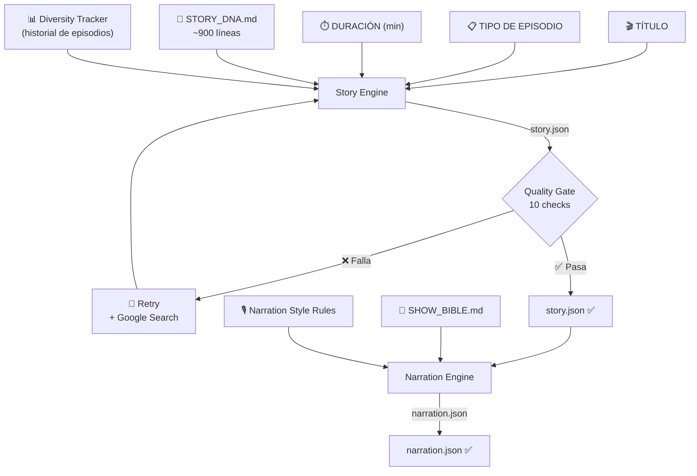
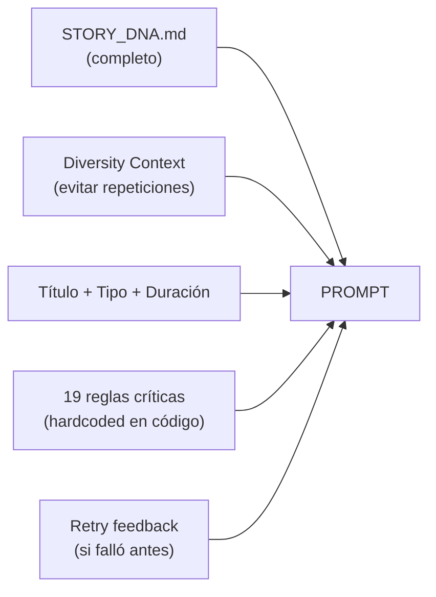
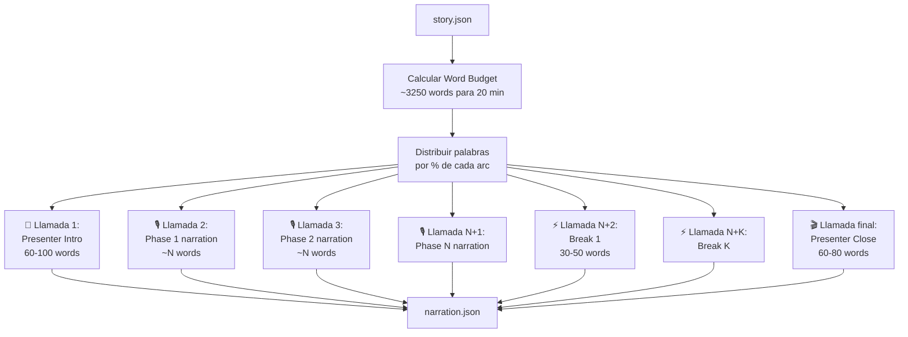

# Motor de Historias y Narración — Cómo Funciona

## Vista General



---

## PARTE 1: HISTORIA (`generate_story`)

### ¿Qué entra?

| Input | Fuente | Para qué |
|---|---|---|
| **Título** | Usuario | Tema y dirección de la historia |
| **Tipo de episodio** | Usuario | `build`, `rescue`, `restore`, `survive`, `full_build`, `critical_system`, `underground`, `cabin_life` |
| **Duración** | Usuario | 5, 10, 15 o 20 minutos |
| **STORY_DNA.md** | Archivo | ~900 líneas: reglas, personajes, técnicas, tipos de episodio, modelos emocionales, anti-patrones |
| **Diversity Tracker** | Historial | Episodios anteriores — evita repetir nombres, locaciones, profesiones, tipos |

### ¿Cómo construye el prompt?



El prompt final es literalmente:
1. **Todo el contenido de `STORY_DNA.md`** (personajes, locaciones, técnicas narrativas, modelos emocionales, tipos de episodio, anti-patrones, arquetipos)
2. **Contexto de diversidad** (nombres, locaciones, profesiones ya usadas — para no repetir)
3. **Instrucción**: "Genera una historia completa para este título"
4. **19 reglas críticas** hardcoded en `_build_story_prompt()`:
   - JSON format estricto
   - Sinopsis estilo Netflix
   - Descripción física detallada para referencia de imágenes
   - Temperaturas realistas
   - `narrative_arcs` suman 100%
   - Nombres de fases = acciones concretas de supervivencia (nunca poéticos)
   - Conflictos = problemas concretos y cortos
   - **Tensión**: curva específica por tipo de episodio (sawtooth para build, sustained high para survive, etc.)
   - Personaje con backstory CREÍBLE
   - `total_days` realista por tipo
   - Animal compañero opcional pero natural
   - Incluir `humor_moment`
5. **Retry feedback** (si hubo intentos fallidos previos)

### Modelo y Parámetros

| | Valor |
|---|---|
| **Modelo** | Gemini 2.5 Pro |
| **Modo** | JSON (structured output) |
| **Temperatura** | 0.7 |
| **Max tokens** | 8,000 |
| **Retries** | Hasta 2 (el último con Google Search grounding) |

### Quality Gate (10 checks)

Después de generar, `validate_story()` evalúa:

| # | Check | Obligatorio |
|---|---|---|
| 1 | Tiene animal compañero con nombre/tipo | ⭐ Bonus |
| 2 | Tiene deadline/timeline | ✅ Sí |
| 3 | Tiene 3+ conflictos (1+ para cabin_life) | ✅ Sí |
| 4 | Conflictos escalan en el tiempo | ✅ Sí |
| 5 | Tiene EL MOMENTO | ✅ Sí |
| 6 | Tiene objeto significativo | ✅ Sí |
| 7 | Tiene voz interna | ✅ Sí |
| 8 | Locación es específica (con km o coma) | ✅ Sí |
| 9 | `narrative_arcs` suman ~100% | ✅ Sí |
| 10 | Tiene momento de humor | ✅ Sí |

**Mínimo para pasar:** todos los obligatorios + `story_strength` ≥ 80/100
**Soft pass:** 7+ checks + strength ≥ 80

Si falla → retry con feedback de qué falló + Google Search para investigar detalles reales.

### ¿Qué sale?

`story.json` con: title, episode_type, duration, synopsis, character (nombre, edad, profesión, origen, motivación, descripción física, voz interna, objeto significativo, animal compañero), location, construction, timeline, conflicts[], narrative_arcs[] (con phase, percentage, tension, description), el_momento, outcome, humor_moment, story_strength.

---

## PARTE 2: NARRACIÓN (`generate_narration`)

### ¿Qué entra?

| Input | Fuente | Para qué |
|---|---|---|
| **story.json** | Paso anterior | Personaje, locación, conflictos, arcos narrativos, timeline |
| **Narration Style** | Hardcoded en código | Reglas de estilo de escritura |
| **SHOW_BIBLE.md** | Archivo | Contexto general del show (no se inyecta directamente al prompt, pero informa el estilo) |

### ¿Cómo genera la narración?

NO es una sola llamada a Gemini. Son **múltiples llamadas independientes**:



### Los 4 tipos de contenido

#### 1. Presenter Intro (1 llamada)
- **Modelo:** Gemini Flash
- **Temp:** 0.7
- **Datos que recibe:** nombre, edad, profesión, origen, motivación, locación, timeline, deadline, tipo de construcción
- **Reglas:** tercera persona, hook inmediato, terminar con "This... is Built to Survive"
- **Largo:** 60-100 palabras

#### 2. Phase Narrations (1 llamada por cada `narrative_arc`)
- **Modelo:** Gemini Flash
- **Temp:** 0.7
- **Datos que recibe por fase:**
  - Personaje + animal compañero
  - Locación + tipo de construcción
  - Descripción de qué pasa en esta fase (`arc.description`)
  - Rango de días (calculado del % de la fase)
  - Nivel de tensión (0-100)
  - Conflictos relevantes a ese rango de días
  - **Word budget** estricto (calculado proporcionalmente al % de la fase)
- **Narration Style** completo inyectado (frases cinematográficas, detalles sensoriales, hook emocional)
- **Reglas:** flujo continuo, párrafos de 3-5 frases, animal aparece naturalmente

#### 3. Presenter Breaks (1 llamada por transición entre capítulos)
- **Modelo:** Gemini Flash
- **Temp:** 0.8 (más creativo)
- **Datos que recibe:** qué fase acaba de terminar, qué viene después, conflicto relevante
- **Reglas:** misterioso, no explicativo, estilo cliffhanger TV, 30-50 palabras
- **Cantidad:** N-1 breaks (donde N = número de arcos narrativos)

#### 4. Presenter Close (1 llamada)
- **Modelo:** Gemini Flash
- **Temp:** 0.7
- **Datos que recibe:** nombre del personaje, tipo de construcción, locación
- **Reglas:** reflexión sin sentimentalismo, teaser del próximo episodio, 60-80 palabras

### Word Budget

| Duración | Total palabras (voiceover) |
|---|---|
| 5 min | 800 |
| 10 min | 1,600 |
| 15 min | 2,400 |
| 20 min | 3,250 |

Las palabras se distribuyen proporcionalmente al `percentage` de cada `narrative_arc`. Por ejemplo, si una fase es el 25% de la historia y el total es 3,250 → esa fase recibe ~812 palabras.

### Narration Style (inyectado en cada prompt de fase)

Reglas activas:
- 3ª persona, presente para acción
- **Frases cinematográficas compuestas (15-35 palabras)** como default
- Frases cortas (5-12 palabras) **solo** para turning points/crisis (máx 2-3 por fase)
- Reflexiones largas (25-50 palabras) conectando acción con meta emocional
- Detalles sensoriales específicos (no "hacía frío" sino "el hielo se forma en su capucha")
- Variedad de vocabulario
- Pensamientos internos del personaje
- **Hook emocional** conectado al modelo emocional del tipo de episodio

### ¿Qué sale?

`narration.json`:
```
├── intro: { text, duration_seconds }
├── phases: [{ phase_name, narration, word_count }]
├── breaks: [{ text, after_chapter, before_chapter, duration_seconds }]
├── close: { text, teaser, duration_seconds }
└── summary: { total_words, voiceover_words, breaks_words, phases_count, breaks_count }
```
